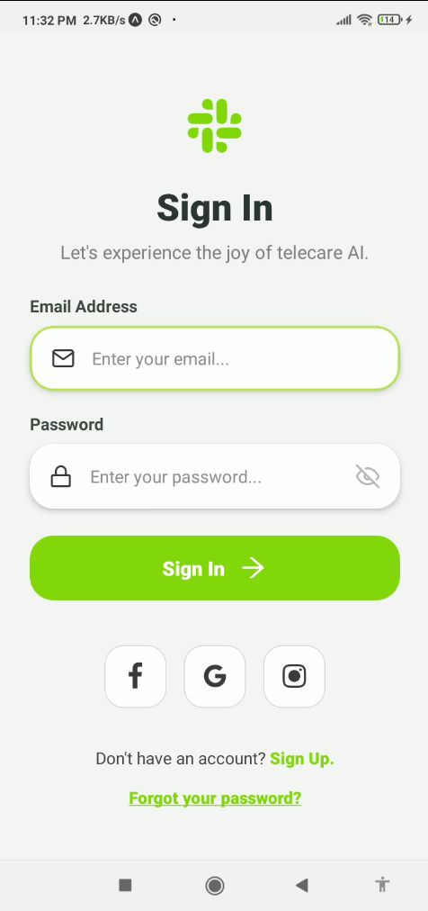
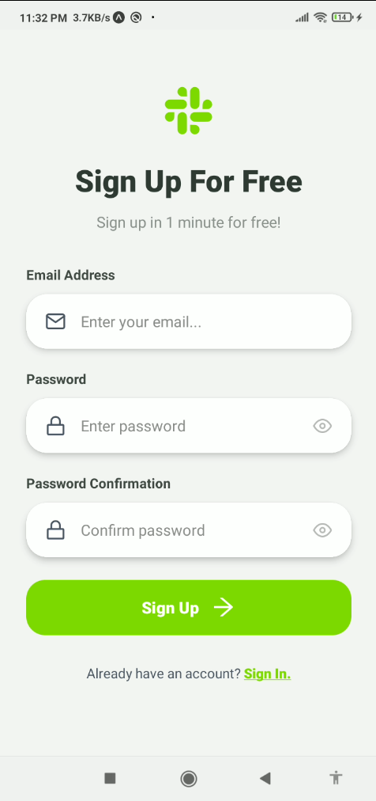
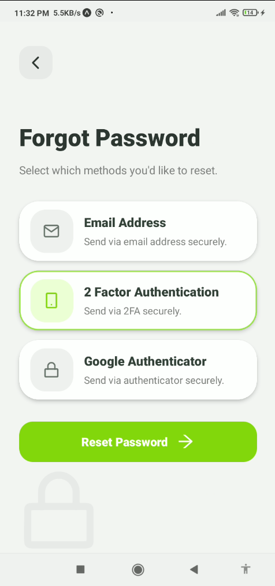

# Dribbble Sign In UI

A React Native Expo project that recreates a clean Dribbble-inspired authentication UI.  
It includes **Sign In**, **Sign Up**, and **Forgot Password** screens with a modern mobile-first design.

---

## Screenshots

| Sign In | Sign Up | Forgot Password |
| :---: | :---: | :---: |
|  |  |  |

---

## Tech Stack

- Expo SDK 54
- React Native 0.81
- React 19
- TypeScript
- `@expo/vector-icons`

---

## Project Structure

```text

src/
└── assets/
   |  ├── signIn.png
   |  ├── signUp.png
   |  └── forgot.png
  ├ app/
   |  ├── index.tsx
   |-components/
      ├── auth/
      │   ├── Auth.tsx
      │   ├── Login.tsx
      │   └── SignUp.tsx
      ├── ForgotPassword.tsx

````

---

## Features

* Clean Dribbble-inspired UI
* Sign In screen
* Sign Up screen
* Forgot Password screen
* Password confirmation validation
* Keyboard-friendly layout
* TypeScript props typing
* Expo vector icons

---

## Getting Started

Install dependencies:

```bash
npm install
```

Start development server:

```bash
npx expo start
```

Run on Android:

```bash
npx expo start --android
```

Run on web:

```bash
npx expo start --web
```

---

## Required Package

```bash
npx expo install @expo/vector-icons
```

---

## Author

Made with React Native + Expo 🚀

```
```
